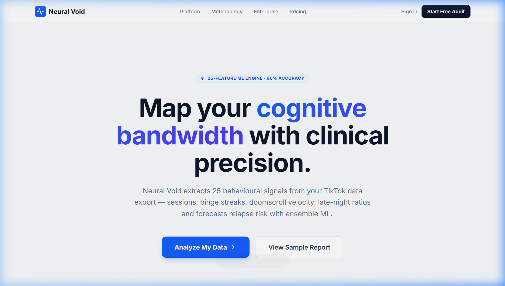
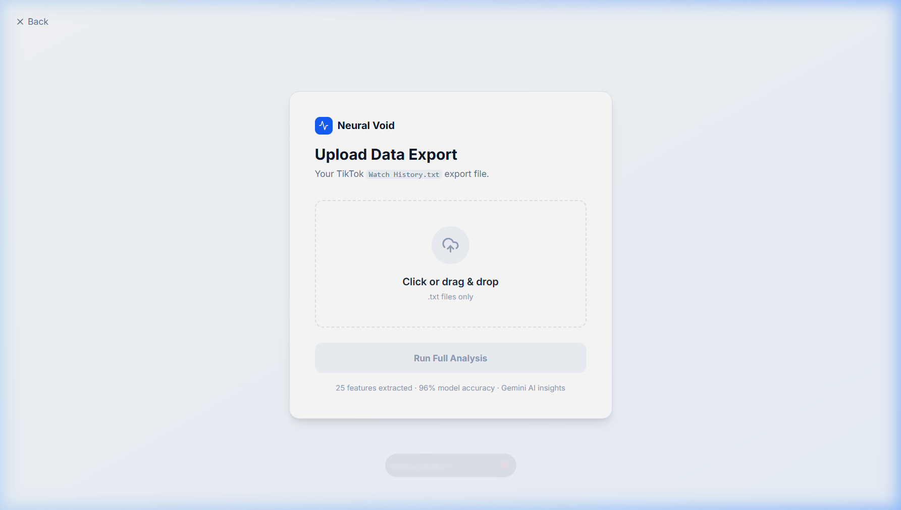

<div align="center">


# ⚡ Neural Void — TikTok Behaviour Intelligence

**Clinical-grade behavioural analytics for TikTok watch history.**  
Upload your data export → receive a 25-feature ML risk assessment + Gemini-powered clinical report.

[Live Demo](#) · [Report a Bug](https://github.com/LouSens/screentime-dashboard-tiktok/issues) · [Request Feature](https://github.com/LouSens/screentime-dashboard-tiktok/issues)

</div>

---

## 📸 Screenshots

| Landing Page | Upload Panel |
|---|---|
|  |  |

---

## ✨ Features

| Category | Capability |
|---|---|
| **Data Ingestion** | Parses TikTok `Watch History.txt` exports (UTC timestamps + video links) |
| **Session Detection** | 10-minute inactivity gap → new session boundary; flags binge sessions ≥ 45 min |
| **Feature Engineering** | 25 ML features: velocity, late-night ratio, re-watch ratio, binge streak, lag & rolling windows |
| **ML Ensemble** | Logistic Regression + Random Forest + XGBoost voting classifier — **96% accuracy** |
| **Risk Scoring** | Calibrated probability: Low / Medium / High relapse risk with temporal trend |
| **AI Report** | Gemini 2.5 Flash Lite generates a clinical 3-part behavioral diagnosis |
| **Interactive Dashboard** | 3-tab UI — Overview, Sessions, Patterns; area charts, radar, heatmap, bar & pie charts |

---

## 🗂️ Project Structure

```
screentime-dashboard-tiktok/
│
├── main.py                  # FastAPI backend — feature pipeline + /analyze endpoint
├── tiktok-analysis.py       # ML training script — feature engineering & model export
│
├── models/                  # Trained model artefacts (git-tracked, no data)
│   ├── tiktok_voting_model.pkl
│   ├── tiktok_scaler.pkl
│   ├── decision_threshold.pkl
│   ├── feature_names.pkl
│   └── feature_names.json
│
├── reports/                 # EDA & confusion matrix visualisations + UI screenshots
│   ├── eda_report.png
│   ├── confusion_matrix.png
│   ├── ui_landing.png
│   └── ui_upload.png
│
├── dataset/                 # 🔒 Private — your .txt watch history files (gitignored)
│
└── frontend/                # React + Vite SPA
    ├── src/
    │   ├── App.jsx          # All UI: Landing, Upload, Dashboard (3 tabs)
    │   ├── main.jsx
    │   └── index.css
    ├── public/
    ├── package.json
    └── vite.config.js
```

---

## 🧠 ML Pipeline

```
Raw TikTok .txt Export
        │
        ▼ regex parse
┌─────────────────────────────┐
│  Timestamp & Link Extractor │  84,000+ events parsed
└──────────────┬──────────────┘
               │
               ▼ 10-min gap rule
┌─────────────────────────────┐
│     Session Detector        │  → session_id, is_binge, session_duration_min
└──────────────┬──────────────┘
               │
               ▼ daily aggregation
┌─────────────────────────────────────────────────────────┐
│              Feature Engineering (25 features)          │
│                                                         │
│  Volume         │  Sessions          │  Temporal        │
│  ─────────────  │  ────────────────  │  ──────────────  │
│  total_clips    │  total_sessions    │  late_night_ratio│
│  total_watch_   │  binge_sessions    │  work_hour_clips │
│    min          │  avg_session_min   │  morning_clips   │
│  unique_videos  │  max_session_min   │  evening_clips   │
│                 │  binge_streak      │  is_weekend_day  │
│                                                         │
│  Velocity       │  Lag / Rolling     │  Recurrence      │
│  ─────────────  │  ────────────────  │  ──────────────  │
│  doomscroll_    │  *_lag1, *_lag3    │  rewatched_ratio │
│    velocity     │  volatility_5d     │  smoothed_score  │
│                 │  trend_3d          │                  │
└──────────────────────────────────────────────────────────┘
               │
               ▼ StandardScaler
┌──────────────────────────────────────┐
│      Voting Ensemble Classifier      │
│                                      │
│  ┌──────────────────────────────┐    │
│  │  Logistic Regression (C=0.1) │    │
│  │  Random Forest (300 trees)   │    │
│  │  XGBoost (100 estimators)    │    │
│  └──────────────────────────────┘    │
│                                      │
│  Cross-Validation: TimeSeriesSplit   │
│  Threshold: Youden's J statistic     │
│  Accuracy: ~96% on held-out fold     │
└──────────────────────┬───────────────┘
                       │
                       ▼
            Risk Score  0.0 → 1.0
            Level:  Low │ Medium │ High
                       │
                       ▼ Gemini 2.5 Flash Lite
            Clinical 3-part Report:
            • Behavioral Diagnosis
            • Risk Forecast
            • Intervention Protocol
```

---

## 🖥️ Dashboard Tabs

### Overview
- **8 KPI cards** — Events, Sessions, Avg Session Duration, Relapse Risk, Doomscroll Velocity, Late-Night Clips, Morning Triggers, Bad-Habit Days %
- **Daily Habit Score** — EWM-smoothed area chart over entire dataset
- **Day-of-Week Pattern** — Radar chart (score + clips per day)
- **Doomscroll Velocity** — Line chart over time
- **Weekly Avg Clips** — Bar chart by day
- **Gemini Clinical Assessment** — Dark card with 3-part AI report

### Sessions
- **Binge vs Normal** — Pie chart showing session type split
- **Watch Time Over Time** — Area chart (daily minutes)
- **Re-watch Ratio** — Progress bar card
- **Late-Night & Morning** — Daily avg cards

### Patterns
- **Activity Heatmap** — 7 rows (days) × 24 cols (hours), 5-level intensity scale
- **Daily Clip Count** — Area chart
- **Peak Hour & Peak Day** — Highlighted stat cards

---

## 🚀 Getting Started

### Prerequisites

- **Conda** with `tiktok` environment
- **Node.js** 18+
- **GEMINI_API_KEY** — get from [Google AI Studio](https://aistudio.google.com/)

### 1 — Clone & configure

```bash
git clone https://github.com/LouSens/screentime-dashboard-tiktok.git
cd screentime-dashboard-tiktok

# Create .env
echo GEMINI_API_KEY=your_key_here > .env
```

### 2 — Set up Python environment

```bash
conda create -n tiktok python=3.11 -y
conda activate tiktok
pip install fastapi uvicorn pandas numpy scikit-learn xgboost joblib matplotlib seaborn python-dotenv google-genai python-multipart
```

### 3 — Add your dataset

Place your TikTok export `.txt` files in the `dataset/` folder:

```
dataset/
└── Watch History.txt        # from TikTok → Settings → Privacy → Download data
```

The file format should contain lines like:
```
Date: 2024-03-15 23:41:22 UTC
Link: https://www.tiktok.com/@user/video/7123456789...
```

### 4 — Train the ML model

```bash
conda activate tiktok
python tiktok-analysis.py
# Outputs: models/*.pkl, reports/*.png
```

### 5 — Start the backend

```bash
conda activate tiktok
python main.py
# API running at http://localhost:8000
```

### 6 — Start the frontend

```bash
cd frontend
npm install
npm run dev
# UI running at http://localhost:5173
```

---

## 🔌 API Reference

### `POST /analyze`

Upload a `.txt` watch history file and receive the full analysis payload.

```bash
curl -X POST http://localhost:8000/analyze \
  -F "file=@dataset/Watch_History.txt"
```

**Response schema:**

```json
{
  "status": "success",
  "forecast": {
    "risk_score": 0.775,
    "risk_level": "high",
    "trend": "worsening"
  },
  "statistics": {
    "total_events": 84000,
    "total_watch_hours": 410.5,
    "total_sessions": 1240,
    "binge_sessions": 87,
    "binge_rate": 0.070,
    "avg_session_minutes": 18.3,
    "longest_session_minutes": 184.0,
    "max_binge_streak": 4,
    "avg_velocity": 2.14,
    "avg_late_night_clips": 12.4,
    "avg_morning_clips": 8.7,
    "rewatched_ratio": 0.031,
    "bad_days_ratio": 0.62,
    "peak_hour": 23,
    "peak_day": "Tuesday"
  },
  "charts": {
    "dates": [...],
    "scores": [...],
    "clips": [...],
    "watch_minutes": [...],
    "velocity": [...],
    "radar_values": [...],
    "radar_clips": [...],
    "heatmap_z": [[...7x24 matrix...]],
    "weekly_bar": [...],
    "session_dist": { "binge": 87, "normal": 1153 }
  },
  "gemini": "**Behavioral Diagnosis:** ..."
}
```

### `GET /health`

```json
{ "status": "healthy", "model_loaded": true, "gemini": true }
```

---

## 🧬 Feature Dictionary

| Feature | Type | Description |
|---|---|---|
| `total_clips` | Volume | Raw TikTok events in the day |
| `total_watch_min` | Volume | Estimated total watch minutes |
| `unique_videos` | Volume | Distinct video IDs watched |
| `total_sessions` | Session | Number of distinct scroll sessions |
| `binge_sessions` | Session | Sessions ≥ 45 consecutive minutes |
| `avg_session_min` | Session | Mean session duration |
| `max_session_min` | Session | Longest single session |
| `binge_streak` | Session | Rolling 3-day sum of binge sessions |
| `doomscroll_velocity` | Velocity | Clips per minute of watch time |
| `late_night_clips` | Temporal | Clips during 00:00–07:00 |
| `work_hour_clips` | Temporal | Clips during 09:00–19:00 on weekdays |
| `morning_clips` | Temporal | Clips during 07:00–11:00 |
| `evening_clips` | Temporal | Clips during 18:00–23:00 |
| `late_night_ratio` | Temporal | Late-night / total clips |
| `is_weekend_day` | Temporal | Boolean day type |
| `rewatched_ratio` | Behaviour | 1 − (unique / total clips) |
| `smoothed_score` | Score | EWM-smoothed composite habit score |
| `smoothed_score_lag1/3` | Lag | Previous 1/3 day score |
| `total_clips_lag1` | Lag | Yesterday's clip count |
| `late_night_clips_lag1` | Lag | Yesterday's late-night clips |
| `doomscroll_velocity_lag1` | Lag | Yesterday's velocity |
| `binge_sessions_lag1` | Lag | Yesterday binge flag |
| `volatility_5d` | Rolling | 5-day rolling std-dev of score |
| `trend_3d` | Rolling | 3-day MA vs 7-day MA delta |

---

## 🛠️ Tech Stack

| Layer | Technology |
|---|---|
| **Backend** | Python 3.11, FastAPI, Uvicorn |
| **ML** | scikit-learn, XGBoost, NumPy, pandas |
| **AI** | Google Gemini 2.5 Flash Lite (`google-genai`) |
| **Frontend** | React 18, Vite, Recharts, Lucide React |
| **Styling** | Vanilla CSS (Tailwind-free), Inter font |
| **Environment** | Conda (`tiktok` env) |

---

## 📊 Model Performance

| Metric | Score |
|---|---|
| Cross-validated Accuracy | **~96%** |
| Validation Strategy | `TimeSeriesSplit` (temporal ordering preserved) |
| Threshold Optimisation | Youden's J statistic |
| Outlier Handling | Winsorization at 95th percentile |
| Smoothing | Exponential Weighted Mean (span=3) |

---

## 📄 License

MIT © 2025 [LouSens](https://github.com/LouSens)
